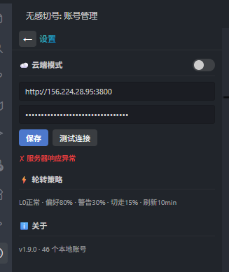

---
name: dao-deploy
description: 部署术：判断项目部署策略（直推/Hook自动/CI-CD），按策略执行连接→环境→推送→构建→服务→记录全流程。
---

# 部署术 · Deploy Skill

> 千里之行，始于足下。部署不是终点，是代码离开本地的第一步。

## 适用场景

- 用户说"上服务器"、"部署"、"推到远程"、"deploy"
- 首次将项目推送到新服务器
- 后续代码更新同步到已部署的服务器

**不适用**：本地开发环境配置

## 铁律

```
先判后通，先通后推，先推后建，先建后起。
每次部署必留记录，记录随代码走。
部署策略匹配风险等级，不过度也不轻率。
```

## 零、判（部署策略分层）

> 在动手之前先判断：这个项目应该怎么部署？

### 决策矩阵

```
项目性质评估：
  1. 谁在用？      内部/开发者 ← → 终端用户/客户
  2. 停机代价？    可接受几秒 ← → 不可接受任何中断
  3. 回滚需求？    手动回滚够 ← → 需要秒级自动回滚
  4. 发布频率？    随时推 ← → 有版本节奏/审批流程
  5. 团队规模？    个人/2-3人 ← → 多人协作/需要审批
```

### 三档策略

| 档位 | 名称 | 适用场景 | 机制 | 停机风险 |
|------|------|---------|------|---------|
| **L1 · 直推** | Push & Pray | 内部工具、开发环境、个人项目 | `git push` + 手动/脚本触发构建重启 | 可接受短暂中断 |
| **L2 · 钩子** | Push & Auto | 内部服务、低流量服务、staging | `git push` → server post-receive hook → 自动 install+build+reload | 零停机（pm2 reload） |
| **L3 · 管线** | CI/CD Pipeline | 面向用户的生产服务、团队协作项目 | push → CI 测试 → 构建镜像 → staging 验证 → 人工审批 → 生产发布 | 零停机 + 秒级回滚 |

### 判定流程

```
用户说"部署这个项目" →

  面向终端用户的生产服务？
    ├─ 是 → 需要自动回滚/蓝绿部署？
    │        ├─ 是 → L3 · 管线（推荐 GitHub Actions / Docker）
    │        └─ 否 → L2 · 钩子（pm2 reload + 构建失败不重启）
    └─ 否 → 内部工具/开发/个人项目
             ├─ 需要常驻服务？
             │    ├─ 是 → L2 · 钩子
             │    └─ 否 → L1 · 直推
             └─ 纯静态站 → L1 · 直推（或 Netlify/Vercel 等托管）
```

**首次部署时必须执行此判定**，结果记录到 DEPLOY.md 的策略字段。
后续更新沿用已定策略，除非项目性质变了。

### L3 管线的边界

dao-deploy **不实现** CI/CD 管线本身（那是平台特定的：GitHub Actions / GitLab CI / Jenkins）。
dao-deploy 在判定为 L3 时：
1. 告知用户需要 CI/CD
2. 推荐平台（根据代码托管选择）
3. 生成基础配置文件（.github/workflows/deploy.yml 等）
4. 记录到 DEPLOY.md

---

## 决策树（六步，判定策略后执行）

### 一、通（SSH 连接就绪？）

```
SSH config 存在该 Host？
  ├─ 是 → 密钥认证可用？
  │        ├─ 是 → 进入下一步
  │        └─ 否 → 生成密钥 → 推送公钥 → 服务器开启 PubkeyAuth → 验证
  └─ 否 → 询问用户：IP、端口、用户名 → 写入 ~/.ssh/config → 同上
```

**检查命令**：
```powershell
ssh -o ConnectTimeout=10 -o BatchMode=yes <user>@<host> "echo OK"
```

**关键动作**：
- `ssh-keygen -t rsa -b 4096` 生成密钥
- 推送公钥到 `~/.ssh/authorized_keys`
- 如服务器 `PubkeyAuthentication no` → 用密码登录修改 sshd_config → 重启 sshd
- SSH config 加 `IdentityFile`、`ServerAliveInterval 60`、`ServerAliveCountMax 3`

### 二、探（服务器环境就绪？）

```
项目技术栈 → 检测服务器环境
  ├─ Node.js 项目 → node -v / npm -v
  ├─ Python 项目 → python3 --version / pip --version
  ├─ Go 项目 → go version
  └─ 静态站 → nginx/caddy 是否存在
缺失 → 安装（apt/yum/nvm/pyenv）
```

**原则**：只装项目需要的，不装多余的。

### 三、推（代码推送）

```
远程有 git repo？
  ├─ 是 → git push <remote> <branch>
  │        └─ "Working directory has unstaged changes" → git checkout -- . 后重试
  └─ 否 → ssh 创建目录 → git init → git config receive.denyCurrentBranch updateInstead
           → 本地 git remote add <name> <url> → git push
```

**remote 命名约定**：
- `origin` = 代码托管（GitHub/GitLab）
- 服务器用有意义的名字：`prod`、`staging`、`server`、`myserver`

### 四、建（依赖安装 + 构建）

```
检测 package.json / requirements.txt / go.mod → 对应安装命令
有 build 脚本 → 远程执行构建
```

**Node.js 典型**：
```bash
cd /path/to/project && npm install
cd hub && npm install  # 子项目
npm run build
```

**注意**：`npm install` 可能修改 `package-lock.json`，导致下次 push 失败。
解决：服务器端 `git checkout -- package-lock.json` 或用 `npm ci`。

### 五、起（服务管理）

```
项目需要常驻服务？
  ├─ 是 → pm2 / systemd / docker
  │        ├─ pm2 start dist/server.js --name <name>
  │        └─ 创建 systemd service 文件
  └─ 否 → 跳过（静态站、CLI 工具等）
```

**首次询问用户**用哪种服务管理方式。记录到 DEPLOY.md。

### 六、记（部署记录）

**首次部署时生成两个文件**：

#### DEPLOY.md（部署元数据）

```markdown
# 部署记录

## 远程服务器：<host-alias>

| 项目 | 值 |
|------|-----|
| **Host 别名** | `<alias>` |
| **IP** | `<ip>` |
| **端口** | `<port>` |
| **用户** | `<user>` |
| **项目路径** | `<path>` |
| **Git Remote** | `<remote-name>` |
| **技术栈** | Node.js v20 / Python 3.11 / ... |
| **初始化日期** | YYYY-MM-DD |

### 初始化步骤

[具体命令记录]

## 推送日志

<!-- DEPLOY_LOG_START -->
| 时间 | 目标 | 版本 | 提交 | 说明 |
|------|------|------|------|------|
<!-- DEPLOY_LOG_END -->
```

#### scripts/deploy.ps1（推送脚本）

由 skill 根据项目实际情况生成，包含：
1. TypeCheck（如适用）
2. Git Push（到所有非 origin remote）
3. 日志追加（自动写 DEPLOY.md）
4. 日志 auto-commit + sync

**PowerShell 注意事项**（已踩过的坑）：
- `|` 在双引号字符串中会被当管道 → 用 `[string]::Format()` 或 `-f` 运算符
- `<` 被当重定向 → 用 `[string]::Concat()` 拼接
- git 进度输出到 stderr → 用 `cmd /c "git push ... 2>&1"` 包裹
- `$ErrorActionPreference = 'Stop'` 会捕获 stderr → git 命令单独处理

### 后续更新流程（按策略分档）

**L1 · 直推**：
本地改完代码 → 提交 → `.\scripts\deploy.ps1`（typecheck + push + 日志）

**L2 · 钩子**：
本地改完代码 → 提交 → `git push <remote>`（或 deploy.ps1）→ 服务器自动 install+build+reload
deploy.ps1 在 L2 下的角色 = 客户端质量门控（typecheck）+ 日志，不负责远程构建。

**L3 · 管线**：
本地改完代码 → 提交 → push to origin → CI/CD 自动测试+构建+部署
deploy.ps1 在 L3 下不存在，被 CI 配置替代。

---

## L2 · 钩子模式详解

L2 是**最常用的自动化档位**。核心是 server-side git post-receive hook。

### post-receive hook 模板

首次部署到 L2 目标时，由 AI 在服务器端生成此 hook：

```bash
#!/bin/bash
# post-receive hook — auto deploy on push
# Generated by dao-deploy skill

PROJECT_DIR="/path/to/project"
LOG_FILE="$PROJECT_DIR/.deploy.log"

echo "$(date '+%Y-%m-%d %H:%M:%S') Deploy triggered" >> "$LOG_FILE"

cd "$PROJECT_DIR" || exit 1

# 1. Checkout latest (updateInstead already did this, but ensure clean)
git checkout -- . 2>/dev/null

# 2. Detect changes and install deps
if git diff HEAD@{1} --name-only | grep -q 'package.json\|package-lock.json'; then
    echo "  npm install..." >> "$LOG_FILE"
    npm ci --production 2>&1 | tail -3 >> "$LOG_FILE"
fi

# 3. Build (if build script exists)
if node -e "const p=require('./package.json');process.exit(p.scripts?.build?0:1)" 2>/dev/null; then
    echo "  building..." >> "$LOG_FILE"
    npm run build 2>&1 | tail -5 >> "$LOG_FILE"
    BUILD_EXIT=$?
    if [ $BUILD_EXIT -ne 0 ]; then
        echo "  BUILD FAILED (exit $BUILD_EXIT), NOT restarting service" >> "$LOG_FILE"
        exit 1
    fi
fi

# 4. Graceful reload (only if service is running)
if command -v pm2 &>/dev/null && pm2 list | grep -q "<service-name>"; then
    echo "  pm2 reload..." >> "$LOG_FILE"
    pm2 reload <service-name> --update-env 2>&1 >> "$LOG_FILE"
fi

echo "  Done" >> "$LOG_FILE"
```

### 安全保障

| 风险 | L2 的应对 |
|------|---------|
| 构建失败 | `BUILD_EXIT` 非零 → 不重启，旧版本继续运行 |
| npm install 中请求进来 | pm2 reload 是最后一步，install 期间旧进程仍在服务 |
| reload 瞬间停机 | `pm2 reload`（不是 restart）= 先起新 → 再杀旧 → 零停机 |
| 需要回滚 | `git push <remote> HEAD~1:master --force` → hook 自动部署上一版 |
| 日志审计 | `.deploy.log` 记录每次部署的时间和结果 |

### L2 的额外设置

首次部署时除了标准六步，还需要：
1. 服务器安装 pm2：`npm install -g pm2`
2. pm2 首次启动服务：`pm2 start dist/server.js --name <name>`
3. pm2 开机自启：`pm2 startup && pm2 save`
4. 创建 post-receive hook 并 `chmod +x`

---

## L3 · 管线模式提示

dao-deploy 不实现 CI/CD 管线本身，但在判定为 L3 时提供：

1. **GitHub Actions 基础模板**（.github/workflows/deploy.yml）
2. **Dockerfile 模板**（如适用）
3. **推荐架构**：push → CI test → build image → push to registry → deploy to server
4. 记录到 DEPLOY.md

---

## DEPLOY.md 策略字段

DEPLOY.md 模板中增加策略记录：

```markdown
| **部署策略** | L1 直推 / L2 钩子 / L3 管线 |
```

---

## 多服务器支持

DEPLOY.md 可包含多个服务器段落，每个可有不同策略档位。
deploy.ps1 默认推送到所有非 origin remote。
指定目标：`.\scripts\deploy.ps1 -Target prod`

## 与其他 Skills 的协作

```
dao-deploy（部署术）
  ├─ 零·判：评估项目性质 → 选择 L1/L2/L3
  ├─ 依赖 dao-boundary-probe（SSH 连通性探测）
  ├─ 触发 dao-research（首次部署新技术栈时研究环境配置）
  └─ 产出（按策略不同）：
       L1 → DEPLOY.md + deploy.ps1
       L2 → DEPLOY.md + deploy.ps1 + server post-receive hook
       L3 → DEPLOY.md + CI/CD 配置文件
```

## 反模式

| 病 | 症 | 治 |
|----|------|------|
| 裸推 | scp/rsync 复制文件，无版本控制 | 必须用 git push |
| 密码依赖 | 每次部署都输密码 | SSH 密钥认证 |
| 口口相传 | 部署信息只在聊天记录里 | DEPLOY.md 随代码走 |
| 手动日志 | 靠人记推送时间 | deploy.ps1 / hook 自动记录 |
| 环境漂移 | 服务器环境和本地不一致 | DEPLOY.md 记录环境版本 |
| 全量推送 | 每次推所有文件 | git push 只推增量 |
| 一刀切 | 所有项目同样部署 | 零号·判，按风险分档 |
| 过度工程 | 个人项目上 K8s | L1/L2 够用就不上 L3 |
